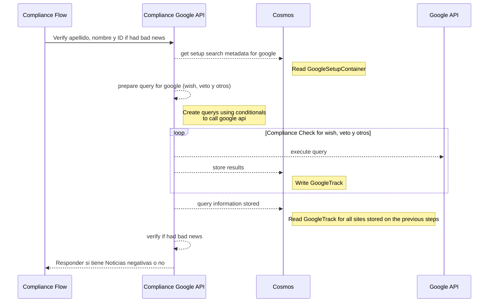
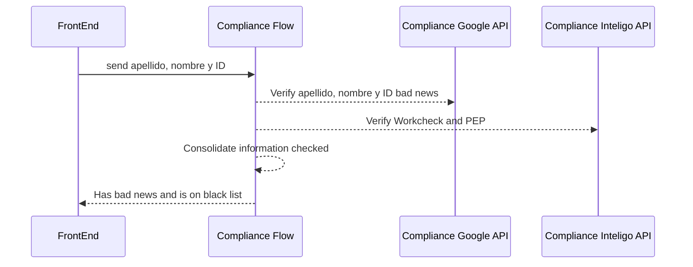

# API de Google 

Para la creacion del API de Google seguir los siguientes pasos con **python3 y docker!**

## Instalar Python y Create venv para desarrollo

- instalar python 3
- pip install virtualenv
- cd compliance-duediligence-google
- python3 -m venv .\venvapi\
- .\venvapi\Scripts\activate.ps1

## instalar paquetes en el venv

- pip install Flask
- pip install numpy

## Activar Virtual Env

- cd compliance-duediligence-google
- .\venvapi\Scripts\activate.ps1

## Instalar del requirements.txt (activar en venv)

- pip install -r requirements.txt

## Generar el requirements.txt

- pipdeptree (mirar las dependencias)
- pip3 freeze > requirements.txt

## Ejecutar Flask

- flask run

## Sequence Diagram Due Diligence Google

## Sequence Diagram Cumplimiento

